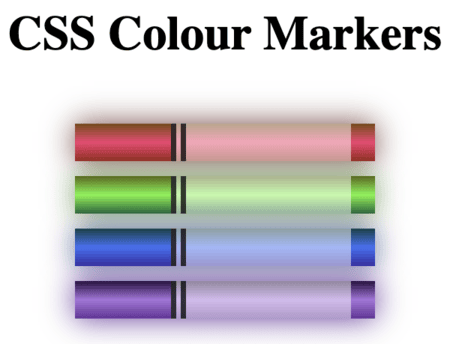

# 🎨 CSS Colour Markers

This project showcases a set of coloured markers using **HTML** and **CSS**. The challenge focuses on selecting and applying colours effectively to enhance the aesthetic appeal of a webpage. You will learn different methods of setting colour values and how to pair colours harmoniously.

## 🛠 Features

- Uses **linear gradients** to create smooth colour transitions.
- Applies **different colour formats**, including:
  - **RGB** (Red, Green, Blue)
  - **Hexadecimal** (`#RRGGBB`)
  - **HSL** (Hue, Saturation, Lightness)
- Implements **box shadows** for a glowing effect around the markers.
- Structures the markers with **flexible and reusable CSS classes**.
- Ensures a **clean layout** with centered text and elements.

## 🎨 Styling

The project applies various CSS techniques to style the markers:

- **Background Gradients**: Smooth colour transitions are applied to each marker.
- **Box Shadows**: Enhances the appearance with a glowing effect.
- **Opacity & Transparency**: The marker sleeves have a semi-transparent white overlay.
- **Alignment**: The content is neatly centered and structured for readability.

## 🚀 How to Use

1. Clone or download this repository.
2. Open `index.html` in a web browser.
3. Observe the different colour markers and their styling.
4. Modify the CSS to experiment with different colours and effects.

## 📸 Preview

## 🔗 Resources

- [CSS Gradients](https://developer.mozilla.org/en-US/docs/Web/CSS/gradient)
- [CSS Box Shadow](https://developer.mozilla.org/en-US/docs/Web/CSS/box-shadow)
- [CSS Color Formats](https://developer.mozilla.org/en-US/docs/Web/CSS/color_value)
- [CSS Display Property](https://developer.mozilla.org/en-US/docs/Web/CSS/display)
- [freeCodeCamp](https://www.freecodecamp.org/learn/2022/responsive-web-design/learn-css-colors-by-building-a-set-of-colored-markers/step-1)
