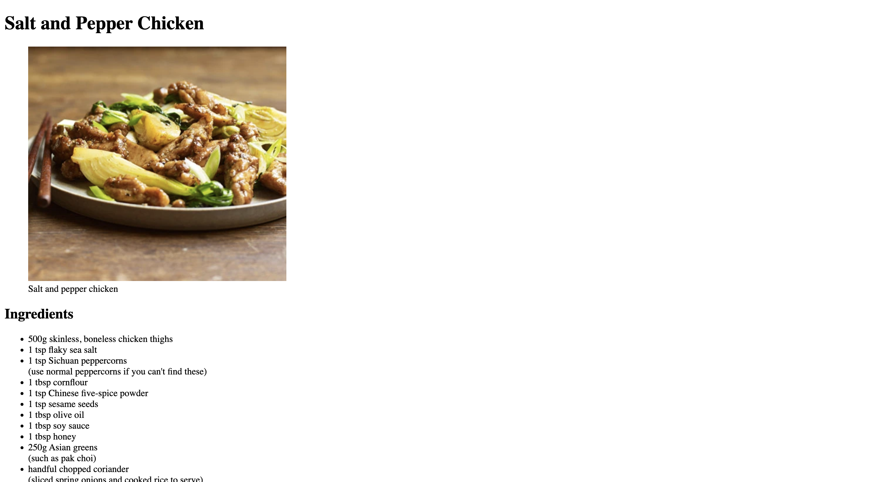

# 🍽️ Favorite Recipe Page

This is a simple webpage that showcases a favorite recipe. The page includes an image, ingredients list, step-by-step instructions, and links for more information.

## 🛠 Features

- Uses **headings** and **sections** for structuring content.
- Displays an **image** of the dish.
- Lists **ingredients** using an unordered list (`<ul>`).
- Shows **step-by-step instructions** using an ordered list (`<ol>`).
- Includes a **link** to more information about the recipe.

## 🚀 How to Use

1. Download or clone this repository.
2. Open `index.html` in a web browser.
3. Enjoy learning HTML while displaying your favorite recipe!

## 📸 Preview

## 🔗 Resources

- [HTML Unordered List](https://developer.mozilla.org/en-US/docs/Web/HTML/Element/ul)
- [HTML Ordered List](https://developer.mozilla.org/en-US/docs/Web/HTML/Element/ol)
- [HTML Image Tag](https://developer.mozilla.org/en-US/docs/Web/HTML/Element/img)
