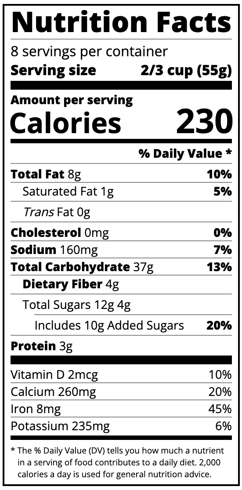

# 🍏 Nutrition Label

This is a simple **Nutrition Label** that displays the nutritional facts for a product, including calories, fats, sugars, vitamins, and minerals.

## 🛠 Features

- Displays the **calories per serving** and other important nutritional information.
- Lists **Total Fat**, **Cholesterol**, **Sodium**, **Carbohydrates**, **Protein**, and more.
- Shows **Vitamin D**, **Calcium**, **Iron**, and **Potassium** content.
- Highlights the **% Daily Value** for each nutrient, based on a 2,000-calorie diet.

## 🚀 How to Use

1. Clone or download the repository.
2. Open the `index.html` file in your web browser.
3. View the nutritional breakdown for a food product. 🌟

## 📸 Preview

A basic nutrition label showing:

- **Calories**: 230 kcal ⚡
- **Total Fat**: 8g (10%) 🍳
- **Cholesterol**: 0mg (0%) ❌
- **Total Carbohydrates**: 37g (13%) 🍞
- **Sugars**: 12g 🍬
- **Protein**: 3g 🍗
- **Vitamins & Minerals**: Vitamin D, Calcium, Iron, Potassium 🌞

## 🎨 Basic CSS Styling

The **nutrition label** is styled with clean, simple CSS to ensure it’s easy to read and visually appealing.

### Key Styling Features:

- **Global styles**: All elements are styled with consistent padding and margins, using `box-sizing: border-box`.
- **Label layout**: The label is centered on the page with a max width of 270px for a compact and easy-to-read format.

- **Typography**: Sans-serif font is used for a modern and clean look, with specific styling for headers and bolded text.

- **Sections**: The layout features dividers between different sections for clarity, and bold text is used to emphasize important information such as **Total Fat**, **Sodium**, and **Protein**.

- **Calories display**: Calories are prominently displayed in large text for easy visibility.

## 🔗 Resources

- [HTML div element](https://developer.mozilla.org/en-US/docs/Web/HTML/Element/div)
- [HTML span element](https://developer.mozilla.org/en-US/docs/Web/HTML/Element/span)
- [CSS Flexbox](https://developer.mozilla.org/en-US/docs/Web/CSS/CSS_Flexible_Box_Layout)

### CSS Resources:

- [MDN CSS Documentation](https://developer.mozilla.org/en-US/docs/Web/CSS)
- [CSS Colors](https://developer.mozilla.org/en-US/docs/Web/CSS/color)
- [CSS Flexbox Layout](https://developer.mozilla.org/en-US/docs/Web/CSS/CSS_Flexible_Box_Layout)
- [CSS Border](https://developer.mozilla.org/en-US/docs/Web/CSS/border)
