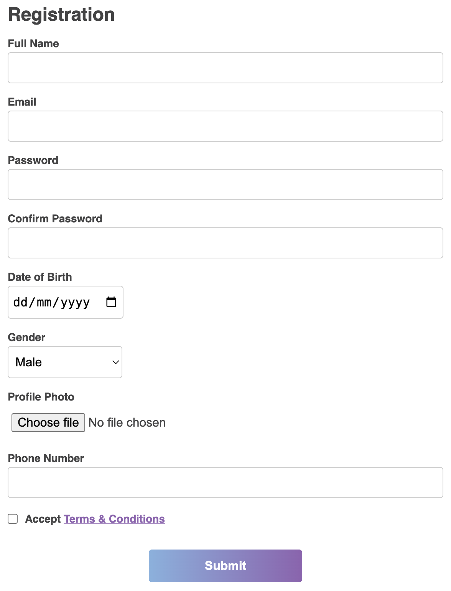

# 📝 Registration Form

This is a simple registration form that allows users to sign up by entering their personal details, including full name, email, password, date of birth, gender, phone number, and an optional profile photo. The form also includes a checkbox for accepting terms and conditions.

## 🛠 Features

- Uses a `<form>` element to structure user input.

- Includes **text inputs** for full name, email, and phone number.

- Provides a **password input** with validation for security.

- Includes **date input** for date of birth selection.

- Uses a **dropdown menu** to select gender.

- Allows users to **upload** a profile photo.

- Includes a **checkbox** to accept terms and conditions.

- Styled with modern CSS for a clean and user-friendly interface.

## 🚀 How to Use

1. Download or clone this repository.

2. Open index.html in a web browser.

3. Fill in the form with your details.

4. Click Submit to complete the registration (note: no backend functionality is implemented).

## 📸 Preview

- A basic HTML registration form with:

- Fields for full name, email, password, date of birth, and gender.

- An upload option for a profile photo.

- A phone number input field.

- A checkbox to accept terms and conditions.

- A submit button.

## 🎨 Basic CSS Styling

The form is styled with simple, modern, and user-friendly CSS.

### Key Styling Features:

- **Global styles**: Ensures all elements have consistent padding and margin with box-sizing: border-box.

- **Form layout**: The form is centered on the page with a max width of 600px.

- **Typography**: Uses a sans-serif font for a clean look, and headers have a specific color.

- **Inputs and buttons**: Styled with borders, padding, and background colors for a neat and modern appearance.

- **Password validation**: Enforces secure password entry with specific requirements.

- **Button styling**: The submit button features a gradient background and a hover effect for improved interactivity.

- **Footer design**: A visually appealing gradient footer with centered text.

## 🔗 Resources

- [HTML Form Element](https://developer.mozilla.org/en-US/docs/Web/HTML/Element/form)
- [HTML Input Types](https://developer.mozilla.org/en-US/docs/Web/HTML/Element/input)
- [HTML Fieldset Element](https://developer.mozilla.org/en-US/docs/Web/HTML/Element/fieldset)
- [HTML Select Element](https://developer.mozilla.org/en-US/docs/Web/HTML/Element/select)
- [Password Validation](https://www.w3schools.com/howto/howto_js_password_validation.asp)

### CSS Resources:

- [MDN CSS Documentation](https://developer.mozilla.org/en-US/docs/Web/CSS)
- [CSS Vertical Alignment](https://www.w3schools.com/cssref/pr_pos_vertical-align.php)

💡 **Note**: This is a frontend-only project with no backend implementation for handling form submissions.
