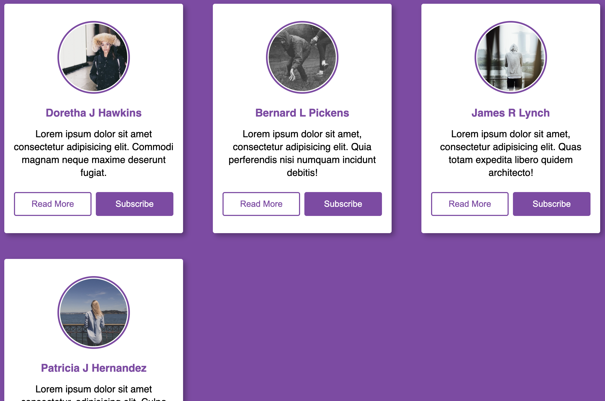

# 🪪 Responsive Profile Cards

A simple, stylish, and responsive profile card component built with **HTML** and **CSS**. This project displays user profile information, including an avatar, name, short bio, and action buttons, with a clean and modern design.

## 🌟 Features

✅ **Responsive Design** – Adjusts to different screen sizes for an optimal viewing experience.  
✅ **Profile Images** – Displays a rounded profile image with a border.  
✅ **User Details** – Shows name and a short bio.  
✅ **Call-to-Action Buttons** – Includes "Read More" and "Subscribe" buttons with hover effects.  
✅ **CSS Styling** – Uses a sleek and minimalistic design with soft shadows and clean typography.

## 🖼️ Preview

## 🛠️ Technologies Used

- **HTML5** – Semantic structure for accessibility and SEO.
- **CSS3** – Custom styling for layout, buttons, and responsiveness.

## 🎨 style.css

- **Global Reset** – Removes default margin and padding.
- **Flexbox Layout** – Aligns and centers profile cards.
- **Responsive Design** – Uses media queries for different screen sizes.
- **Hover Effects** – Interactive buttons change colors on hover.

## 📱 Responsive Design

- ✔️ **Mobile First Approach** – Stacks cards in a single column for smaller screens.
- ✔️ **Tablet View (768px+)** – Displays two cards side by side.
- ✔️ **Desktop View (1440px+)** – Shows up to three cards in a row.

## 🎯 How to Customize

- Replace the profile images in ./images/ with your own.
- Modify user names and bios in the HTML file.
- Adjust colors and fonts in style.css.

## 🔗 Useful Resources

- [CSS Flexbox](https://developer.mozilla.org/en-US/docs/Web/CSS/CSS_Flexible_Box_Layout)
- [CSS Media Queries](https://developer.mozilla.org/en-US/docs/Web/CSS/Media_Queries)
- [HTML Image Tag](https://developer.mozilla.org/en-US/docs/Web/HTML/Element/img)
