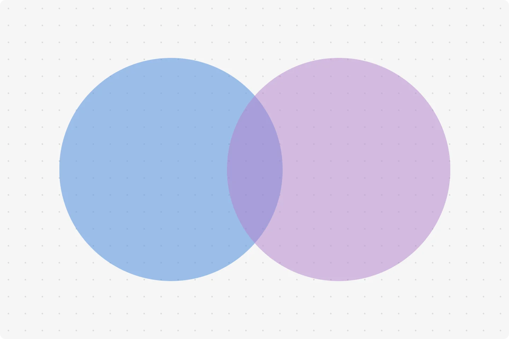

# 📚 Introduction to Elementary Set Theory

This is a beginner-friendly introduction to **Set Theory**, covering its basic concepts, types of sets, and operations. It provides structured content along with visual representations to help learners grasp fundamental set-theoretic principles.

## 🖼️ Preview

  
_Image by [GeeksforGeeks](https://www.geeksforgeeks.org/set-theory/)_

## 📖 What is Set Theory?

Set theory is a branch of mathematics that studies **sets**, which are collections of objects. These objects, called **elements** or **members**, can be numbers, symbols, or even other sets. Set theory forms the foundation for many mathematical disciplines, including **algebra, topology, and logic**.

## 🏗 Basic Concepts of Set Theory

### 🔹 Definition of a Set

A **set** is a well-defined collection of distinct objects, typically denoted by **capital letters**, with elements enclosed in **curly brackets `{}`**.

**Example:**

- \( A = \{1,2,3,4,5\} \)
- \( B = \{a,b,c,d\} \)

### 📌 Ways to Represent Sets

There are **three common ways** to represent a set:

1. **Roster Form:** Listing all elements explicitly.
   - **Example:** \( A = \{2,4,6,8\} \)
2. **Set-Builder Notation:** Defining elements using a property.
   - **Example:** \( A = \{ x \mid x \text{ is an even number less than 10} \} \)
3. **Venn Diagrams:** Using circles to show relationships between sets.
   - 

### 🔢 Types of Sets

- **Empty Set (∅ or `{}`):** A set with no elements.
  - **Example:** The set of prime numbers divisible by 10.
- **Finite & Infinite Sets:**
  - A set with a countable number of elements is **finite**; otherwise, it’s **infinite**.
  - **Example:** The set of natural numbers (\(\mathbb{N}\)) is infinite.
- **Subset (⊆):** A set \( A \) is a **subset** of \( B \) if all elements of \( A \) are in \( B \).
- **Universal Set (U):** The set containing **all elements** under consideration.

### ✂ Set Operations

Set theory involves **four main operations**:

- **Union (A ∪ B):** All elements in \( A \) or \( B \) or both.
- **Intersection (A ∩ B):** Common elements between \( A \) and \( B \).
- **Difference (A - B):** Elements in \( A \) but not in \( B \).
- **Complement (Aᶜ):** Elements not in \( A \).

## 🎯 Why is Set Theory Important?

Set theory is fundamental to various fields, including:

- **Mathematics:** Forms the basis of algebra, topology, and combinatorics.
- **Computer Science:** Used in database management, algorithms, and artificial intelligence.
- **Logic & Proofs:** Helps in formal reasoning and theorem proving.
- **Data Science:** Utilized for grouping and categorizing data in statistics and probability.

## 📚 Further Reading & References

### 🎓 Online Courses

- [Introduction to Set Theory – Coursera](https://www.coursera.org/)  
  _(Search for "Set Theory" in their catalog)_
- [Discrete Mathematics – Khan Academy](https://www.khanacademy.org/computing/computer-science/cryptography/discrete-mathematics/a/sets-and-set-notation)
- [MIT OpenCourseWare – Discrete Mathematics](https://ocw.mit.edu/courses/mathematics/)

### 📖 Books on Set Theory

- _"Naïve Set Theory"_ – Paul R. Halmos
- _"Set Theory and Logic"_ – Robert R. Stoll
- _"Elements of Set Theory"_ – Herbert B. Enderton

### 📄 Research Papers & Academic References

- _"Axiomatic Set Theory"_ – Patrick Suppes _(Available on JSTOR)_
- _Cantor’s Original Paper on Set Theory:_  
  _"Contributions to the Founding of the Theory of Transfinite Numbers"_ – Georg Cantor
- [Stanford Encyclopedia of Philosophy – Set Theory](https://plato.stanford.edu/entries/set-theory/)

## 🎨 Styling and Layout

The content is styled with **modern and responsive CSS**, ensuring clarity and readability.

### 🖌 Key CSS Features:

- **Typography:** Clean, sans-serif fonts with optimized line height.
- **Layout:** Centered content with a **max-width of 550px**.
- **Images:** Properly aligned and styled for responsiveness.
- **Example Sections:** Highlighted in **light teal backgrounds** for emphasis.
