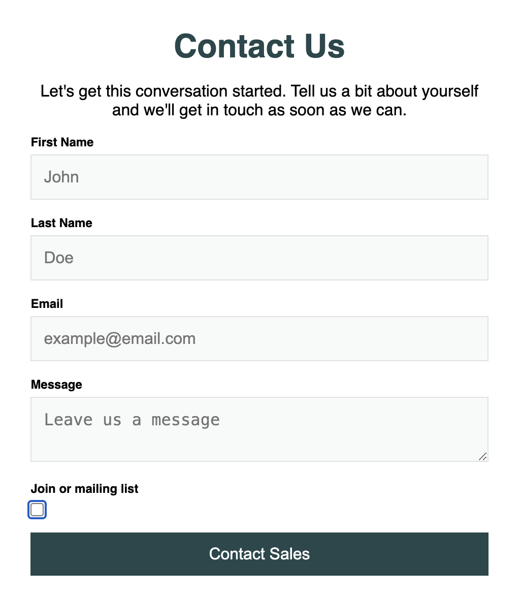

# 📩 Contact Form

This is a simple contact form that allows users to enter their first name, last name, and email address, and optionally join a mailing list.

## 🛠 Features

- Uses a `<form>` element to structure user input.
- Includes **text inputs** for first and last name.
- Provides an **email input** with validation.
- Includes a **checkbox** for joining the mailing list.
- Uses a **submit button** to send the form.

## 🚀 How to Use

1. Download or clone this repository.
2. Open `index.html` in a web browser.
3. Fill in the form and click **Submit** (note: no backend functionality is implemented).

## 📸 Preview

A basic HTML form with:

- First name and last name fields.
- An email input field.
- A checkbox to join the mailing list.
- A submit button.

## 🎨 Basic CSS Styling

The form is styled with simple, clean, and modern CSS.

### Key Styling Features:

- **Global styles**: Ensures all elements have consistent padding and margin with `box-sizing: border-box`.

- **Form layout**: The form has a max width of 550px and is centered on the page.

- **Typography**: Sans-serif font is used for a clean look, and the header has a specific color.

- **Inputs and buttons**: Styled with light borders, padding, and background colors for a neat and modern appearance.

- **Button**: The submit button is styled with a bold background color and text for clarity. Additionally, a hover effect is applied, changing the background color to a darker shade of the button’s original color, providing a visual cue for interactivity.

## 🔗 Resources

- [HTML Form Element](https://developer.mozilla.org/en-US/docs/Web/HTML/Element/form)
- [HTML Input Types](https://developer.mozilla.org/en-US/docs/Web/HTML/Element/input)
- [HTML Fieldset Element](https://developer.mozilla.org/en-US/docs/Web/HTML/Element/fieldset)

### CSS Resources:

- [MDN CSS Documentation](https://developer.mozilla.org/en-US/docs/Web/CSS)
- [CSS Box Model](https://developer.mozilla.org/en-US/docs/Web/CSS/CSS_Box_Model)
- [CSS Colors](https://developer.mozilla.org/en-US/docs/Web/CSS/color)
- [CSS Specificity](https://developer.mozilla.org/en-US/docs/Web/CSS/Specificity)
