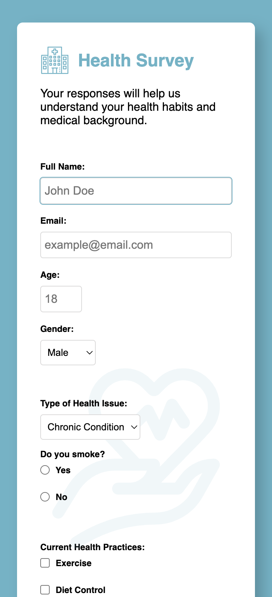

# 🏥 Health Survey Form

The Health Survey Form was created as part of a certification project for **freeCodeCamp**.

It meets all required criteria, including a title **(h1)** with an ID of title and a brief description **(p)** with an ID of description. The form **(id="survey-form")** includes labeled input fields for name, email, and age, with proper HTML5 validation for incorrect formats. A dropdown menu **(id="dropdown")** allows users to select an option, while radio buttons and checkboxes enable multiple-choice responses. A textarea is provided for additional comments, and a submit button **(id="submit")** finalizes the form submission. The project ensures accessibility, usability, and validation compliance.

[freeCodeCamp - Build a Survey Form Project ](https://www.freecodecamp.org/learn/2022/responsive-web-design/build-a-survey-form-project/build-a-survey-form)

## 🛠 Features

- Uses a `<form>` element to structure user input.
- Includes **text inputs** for name, email, and age.
- Provides a **dropdown menu** for selecting gender and health conditions.
- Includes **radio buttons** for smoking habits.
- Features **checkboxes** for tracking health practices.
- Uses a **textarea** for additional medical details.
- Styled with **CSS** for a clean and modern appearance.

## 🚀 How to Use

1. Download or clone this repository.
2. Open `index.html` in a web browser.
3. Fill in the form with your health details and submit (note: no backend functionality is implemented).

## 📸 Preview

The form includes:

- Name, email, and age input fields.
- A dropdown menu for gender selection.
- Checkboxes for selecting health practices.
- A textarea for additional medical information.
- A submit button for form submission.

## 🎨 Basic CSS Styling

The form is designed with a simple and modern look.

### Key Styling Features:

- **Global styles**: Ensures consistency with `box-sizing: border-box` for all elements.
- **Form layout**: The form has a max width of 600px and is centered on the page.
- **Typography**: Uses a sans-serif font for a clean appearance.
- **Inputs and buttons**: Styled with borders, padding, and background colors.
- **Button**: Styled with a bold background color and a hover effect to enhance user interaction.

## 🔗 Resources

- [HTML Form Element](https://developer.mozilla.org/en-US/docs/Web/HTML/Element/form)
- [HTML Input Types](https://developer.mozilla.org/en-US/docs/Web/HTML/Element/input)
- [HTML Select Element](https://developer.mozilla.org/en-US/docs/Web/HTML/Element/select)
- [HTML Textarea Element](https://developer.mozilla.org/en-US/docs/Web/HTML/Element/textarea)

### CSS Resources:

- [MDN CSS Documentation](https://developer.mozilla.org/en-US/docs/Web/CSS)
- [CSS Box Model](https://developer.mozilla.org/en-US/docs/Web/CSS/CSS_Box_Model)
- [CSS Colors](https://developer.mozilla.org/en-US/docs/Web/CSS/color)
- [CSS Flexbox](https://developer.mozilla.org/en-US/docs/Web/CSS/CSS_Flexible_Box_Layout)

---

⭐ **If you find this project useful, feel free to star it!**
